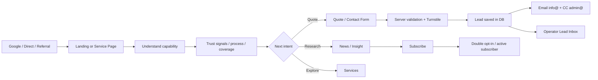
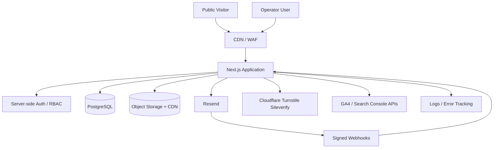
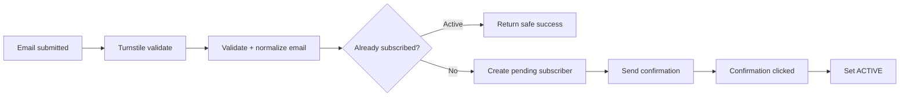
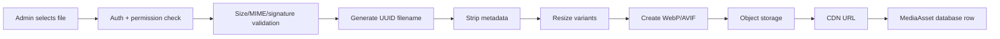

# GAEKS.COM — Product Requirement Document (PRD) v2.0
## Website, Operator CMS, Security, SEO, Newsletter & Analytics Redesign

**Product:** GAEKS / Global Andalan Ekspress  
**Domain:** `https://gaeks.com`  
**Operator:** `https://gaeks.com/operator`  
**Repository:** `gaeksgroup-hash/gaeks-freight`  
**Document date:** 17 September 2026  
**Status:** Proposed target architecture & migration plan  
**Scope:** Public corporate website, service pages, news, lead generation, operator/CMS, media pipeline, newsletter, analytics, SEO, security, deployment, and migration of existing features.

---

## 1. Executive Summary

GAEKS.com should be rebuilt from the current browser-heavy Vite/React SPA plus PHP/JSON persistence into a secure, server-rendered, data-driven corporate platform for freight forwarding, customs brokerage/PPJK, import/export, trucking, warehousing, air freight, ocean freight, and project cargo.

The redesign is not a cosmetic refresh. It is a controlled migration of the current website into a **modular full-stack application** with:

- SEO-friendly public pages rendered on the server.
- A protected `/operator` control center.
- Database-owned content instead of browser `localStorage`.
- Server-side authentication and authorization.
- Role-based access control (RBAC).
- News CMS with draft/review/publish workflow.
- Secure media library with automatic processing.
- Newsletter subscriptions and broadcasts from `news@gaeks.com`.
- Contact/lead form delivery to `info@gaeks.com` with CC to `admin@gaeks.com`.
- Site analytics, Search Console metrics, newsletter metrics, contact-lead metrics, and content performance.
- Search-engine architecture based on useful, distinct service pages rather than mass keyword pages.
- Cloudflare Turnstile on public forms and authentication abuse controls.
- Proper secrets management, audit logs, security headers, rate limiting, backups, and production monitoring.

The recommended target stack in September 2026 is **Next.js 16.3.3+ Active LTS + React 19.3 + TypeScript + Tailwind CSS v4 + shadcn/ui + PostgreSQL + Prisma 7 stable**. The application should remain a **modular monolith** initially; microservices are not justified for the current product scope.

---

# 2. Current-State Audit

## 2.1 Current application architecture

The repository currently uses:

- React 18.2.
- Vite 5.
- Tailwind CSS 3.
- TypeScript 5.2.
- Static SPA deployment.
- Hash-based navigation.
- PHP endpoints under `public/api`.
- JSON files for shared site state.
- `localStorage`/`sessionStorage` for important client state.
- FTP deployment to Hostinger through GitHub Actions.

Important current features to preserve conceptually:

- Home/hero.
- Services.
- Smart calculator.
- Interactive logistics/network map.
- News.
- Contact.
- Multilingual UI.
- Operator interface.
- Media upload.
- Editable branding/content.
- Subscriber list.
- Existing Hostinger deployment automation.

These features should be migrated, not blindly discarded.

---

## 2.2 Critical security findings

### CRITICAL-01 — Authentication credential is hard-coded in public source

The current operator credential is embedded in frontend code and is also checked by a PHP endpoint. Because the repository is public, this credential must be treated as compromised.

**Required immediate action:**

1. Rotate the exposed credential before any other development work.
2. Remove all client-side credential comparison.
3. Remove the credential from PHP source.
4. Invalidate any persistence/session mechanism that trusted that credential.
5. Review GitHub secret-scanning alerts.
6. Do not rely on deleting the string from the latest commit: the old credential must be revoked/rotated.
7. Enable secret scanning / push protection and add CI secret detection.

**Important:** this PRD intentionally does not reproduce the exposed credential.

### CRITICAL-02 — Operator login is client-side only

Current login state is represented by a browser storage flag. A browser flag is not authorization.

**Target behavior:** every operator page and every privileged mutation must re-check a server-side authenticated session and permission.

### CRITICAL-03 — Media upload/delete endpoint is effectively public

The current upload API permits upload and delete operations without proper server-side authentication/authorization.

Risks include:

- unauthorized file upload;
- unauthorized file deletion;
- malicious-content hosting;
- storage exhaustion;
- unsafe SVG/content execution;
- abuse as a public file host;
- denial of service.

**Immediate containment:** disable writes or place the endpoint behind server authentication until replacement is ready.

### HIGH-04 — Broad CORS and weak filesystem permissions

Current PHP endpoints use broad CORS and permissive file/directory modes.

**Target:**

- same-origin by default;
- explicit allowed origins only when required;
- least-privilege filesystem permissions;
- object storage rather than writable public application directories.

### HIGH-05 — Data authority is split between browser storage and flat JSON

Branding, services, news, subscribers, and operator state currently depend on browser storage and synchronized JSON.

This causes:

- inconsistent state between devices;
- no proper concurrency control;
- no reliable user attribution;
- no database constraints;
- no durable audit log;
- no safe role isolation;
- limited backup/restore;
- poor CMS workflow.

**Target:** PostgreSQL is authoritative. Browser state is cache/UI state only.

### HIGH-06 — Newsletter is not a real email subscription platform

Subscriber data is currently browser-oriented, while broadcast delivery and suppression management are missing.

### HIGH-07 — Contact form does not implement the requested email flow

The current contact form primarily opens WhatsApp. It does not yet implement:

- server-side lead storage;
- email to `info@gaeks.com`;
- CC to `admin@gaeks.com`;
- Turnstile;
- rate limiting;
- operator lead inbox;
- delivery status/audit.

WhatsApp can remain as a secondary CTA.

---

## 2.3 Repository hygiene findings

The repository currently contains generated/build artifacts and multiple large rebuild/update scripts.

Target repository hygiene:

```text
/
  app/
  components/
  lib/
  server/
  prisma/
  public/
  emails/
  tests/
  docs/
  .github/
  package.json
  next.config.ts
  tsconfig.json
  .env.example
  .gitignore
```

Remove from source control:

- `node_modules/`
- generated `dist/`
- local `.env*` files except `.env.example`
- one-off migration/rebuild scripts that no longer represent product source
- generated JSON runtime content
- user uploads

Retain old code in a tagged/archived migration branch if needed instead of leaving numerous generator files in production `main`.

---

# 3. Product Goals

## 3.1 Business goals

1. Position GAEKS as a credible Indonesian freight-forwarding and PPJK company.
2. Increase qualified inbound leads.
3. Improve discoverability for logistics/import/export/customs searches.
4. Make website content manageable without code edits.
5. Turn news into a recurring acquisition/retention channel.
6. Provide management visibility into traffic, leads, newsletter growth, and content performance.
7. Build a secure base for future client portal / ERP / customs integrations.

## 3.2 User goals

### Public visitor

- Understand what GAEKS does in under 10 seconds.
- Find the correct service.
- Understand process, documents, coverage, and capabilities.
- Request a quote/contact staff easily.
- Read useful logistics/customs updates.
- Subscribe or unsubscribe safely.
- Use the site well on mobile.

### CMS editor

- Create/edit/review/publish news without touching code.
- Upload optimized media.
- Preview desktop/mobile.
- Manage SEO fields safely.

### Site admin

- Edit global website content, services, menus, contact data, logos, images, and SEO configuration.
- View leads and site metrics.

### Super admin

- Full site control.
- User/role management.
- Audit log access.
- Security/integration configuration.
- Recovery controls.

---

# 4. Non-Goals for Initial Release

The first redesigned release will not attempt to become the full internal ERP.

Out of scope for initial public-web rebuild:

- full freight operations ERP;
- accounting;
- customs filing automation;
- direct CEISA submission;
- customer billing;
- warehouse management system;
- HR;
- fleet dispatching.

The architecture must leave clean integration boundaries so those systems can be connected later.

---

# 5. Information Architecture

## 5.1 Public route structure

Recommended canonical structure:

```text
/
├── /tentang-kami
├── /layanan
│   ├── /ppjk-customs-clearance
│   ├── /import-forwarding
│   ├── /export-forwarding
│   ├── /freight-laut-lcl-fcl
│   ├── /freight-udara
│   ├── /trucking
│   ├── /pergudangan
│   ├── /project-cargo
│   ├── /import-kosmetik          (only if service is real and content is substantial)
│   └── /import-tekstil           (only if service is real and content is substantial)
├── /kalkulator
├── /jaringan
├── /insight
│   └── /[slug]
├── /kontak
├── /privacy
├── /terms
├── /unsubscribe
├── /sitemap.xml
├── /robots.txt
└── /operator
```

If multilingual SEO is required, use real locale routes:

```text
/id/...
/en/...
/zh/...
```

with translated CMS content and `hreflang`. Do not depend on client-only machine translation for important SEO pages.

---

# 6. Public Website UX Flow

## 6.1 Primary acquisition flow



## 6.2 Homepage structure

Recommended order:

1. Utility bar: email / WhatsApp / office context.
2. Main navigation.
3. Hero:
   - clear freight-forwarding + PPJK positioning;
   - primary CTA: `Minta Penawaran`;
   - secondary CTA: `Lihat Layanan`;
   - optional compact quote selector.
4. Trust strip:
   - service coverage;
   - customs/PPJK proof only when factually supportable;
   - operational locations;
   - customer/partner logos only with permission.
5. Service bento.
6. “How we handle your shipment” process.
7. Network / major gateways.
8. Calculator / route planning teaser.
9. Industry/use-case solutions.
10. Why GAEKS / differentiators.
11. Case study / proof.
12. Latest insights.
13. Newsletter.
14. Final CTA.
15. Footer.

---

# 7. UI/UX Design System

The visual design should use the **methodology** of UI/UX Pro Max rather than copying an unrelated template.

## 7.1 Design direction

Product type: **B2B logistics / freight forwarding / customs services**.

Desired design language:

- Clean Corporate.
- Swiss-inspired information hierarchy.
- Minimal but data-confident.
- Strong trust cues.
- High legibility.
- Functional motion.
- Mobile-first.
- No unnecessary neon/glass effects.
- No animation that interferes with reading or conversion.

## 7.2 Brand palette

Proposed semantic palette:

```text
Primary / Oceanic Teal: #012E34
Primary Deep:           #011C20
Ink:                    #0F172A
Canvas:                 #F8FAFC
Surface:                #FFFFFF
Cyan accent:            brand cyan, formalized as design token
Success:                semantic green
Warning:                semantic amber
Danger:                 semantic red
```

Use semantic tokens instead of hard-coded colors in each component.

Example:

```text
--color-brand-700
--color-brand-900
--color-accent-500
--color-surface
--color-text-primary
--color-text-muted
--color-border
--color-danger
```

## 7.3 Typography

Recommended:

- Display / Headings: `Manrope`, `Plus Jakarta Sans`, or another tested corporate geometric sans.
- Body/UI: `Inter`.

Choose one pair and use it consistently.

## 7.4 Accessibility acceptance

Minimum:

- WCAG 2.2 AA target.
- Normal text contrast ≥ 4.5:1.
- Visible `:focus-visible`.
- Keyboard-operable menus/forms/dialogs.
- Minimum comfortable 44×44 px interaction target.
- Semantic headings.
- Accessible form labels.
- Error summary/focus handling.
- Reduced-motion support.
- No horizontal scroll at 375, 768, 1024, 1440 px.
- Image alt text controlled in CMS.
- Charts use text/labels, not color alone.

---

# 8. Target Technical Architecture

## 8.1 Recommended stack

| Layer | Recommendation |
|---|---|
| Framework | Next.js 16.3.3+ Active LTS, App Router |
| UI runtime | React 19.3 |
| Language | TypeScript |
| CSS | Tailwind CSS v4 |
| Component system | shadcn/ui + Radix primitives |
| Database | PostgreSQL |
| ORM | Prisma 7 stable |
| Validation | Zod |
| Auth | Server-side auth library with DB-backed sessions, MFA support |
| Email | Resend |
| Newsletter | Resend Contacts/Segments/Broadcasts; custom queue only if required |
| Bot protection | Cloudflare Turnstile |
| Rate limiting | Redis/Upstash or edge/provider rate limiting |
| Object storage | S3-compatible object storage + CDN |
| Image pipeline | Sharp |
| Analytics | GA4 + Google Search Console; optional PostHog |
| Observability | Structured logs + error tracking + uptime checks |
| CI/CD | GitHub Actions |
| Security | Secret scanning, dependency scanning, SAST, CSP, security headers |

## 8.2 Why migrate from Vite SPA

The current Vite SPA is effective for interactive UI but is not a strong foundation for:

- per-page server metadata;
- authenticated operator routes;
- secure server mutations;
- CMS/database access;
- secure media signing;
- role authorization;
- server-generated service/news pages;
- email/webhook processing;
- SEO-oriented rendering.

Next.js consolidates public SSR/SSG/ISR and secure server-side product features into one deployable application.

## 8.3 Architecture principle

Use a **modular monolith**, not microservices.

Modules:

```text
auth
users-rbac
site-content
services
news
media
leads
newsletter
analytics
seo
audit
integrations
```

Every module has:

- schema/data access;
- service/business logic;
- permissions;
- validation;
- route/server action;
- UI.

---

# 9. Target Request Architecture



---

# 10. Authentication & RBAC

## 10.1 Authentication requirements

Operator authentication must:

- happen on server;
- use hashed passwords if password auth is used;
- never compare credentials in client JavaScript;
- use Secure + HttpOnly cookies;
- use a server-side session or signed/encrypted session framework;
- enforce session expiry;
- support forced logout/revocation;
- record login events;
- rate-limit failed login attempts;
- require Turnstile after abuse threshold or on login;
- require MFA for privileged roles.

## 10.2 Bootstrap super admin

`admin@gaeks.com` is the initial protected owner identity.

Do **not** implement this as:

```ts
if (email === "admin@gaeks.com") return allPermissions;
```

Instead:

- seed the initial user into the database;
- assign `SUPER_ADMIN`;
- mark the account `is_owner = true`;
- disallow deletion/demotion of the last owner;
- store bootstrap values in deployment secrets, not Git;
- after first successful setup, rotate bootstrap secret.

## 10.3 Roles

### SUPER_ADMIN

- all permissions;
- users/roles;
- integrations;
- audit logs;
- site settings;
- content;
- media;
- newsletter;
- analytics;
- security configuration.

### SITE_ADMIN

- global site content;
- services;
- navigation;
- media;
- leads;
- SEO;
- publish pages;
- no ownership/security-secret changes.

### CMS_ADMIN

- news draft/edit/publish according to workflow;
- media for news;
- article SEO;
- no global site identity;
- no role management.

### ANALYST

- analytics read-only;
- newsletter metrics read-only;
- aggregate lead metrics;
- no PII export unless explicitly granted.

### SUPPORT / SALES

- lead inbox;
- lead status/notes;
- no site publishing.

Permissions should be stored as explicit capabilities, e.g.:

```text
site.settings.read
site.settings.write
services.read
services.write
services.publish
news.read
news.create
news.edit
news.publish
media.read
media.upload
media.delete
leads.read
leads.update
newsletter.read
newsletter.send
analytics.read
users.read
users.manage
audit.read
```

---

# 11. `/operator` Information Architecture

```text
/operator/login
/operator
/operator/content
/operator/navigation
/operator/services
/operator/news
/operator/media
/operator/leads
/operator/newsletter
/operator/analytics
/operator/seo
/operator/users
/operator/roles
/operator/audit
/operator/settings
```

## 11.1 Dashboard cards

Dashboard should show:

- sessions/visitors;
- organic search clicks;
- Search Console impressions;
- lead submissions;
- lead conversion by landing page;
- active newsletter subscribers;
- subscriber growth;
- newsletter delivery/click/unsubscribe;
- top pages;
- top service pages;
- latest published content;
- drafts requiring review;
- media/storage use;
- failed form/mail/webhook events;
- security/audit summary.

Use cached/snapshotted analytics; do not make every dashboard load depend on multiple live third-party APIs.

---

# 12. Content Management

## 12.1 Global site settings

Editable in operator:

- company display name;
- tagline;
- logo variants;
- favicon;
- primary contacts;
- WhatsApp;
- address;
- social links;
- footer text;
- CTA labels;
- navigation;
- homepage content blocks;
- selected homepage service/news items;
- SEO defaults;
- social sharing image.

## 12.2 Publishing model

All important editable content should support:

```text
DRAFT
IN_REVIEW
SCHEDULED
PUBLISHED
ARCHIVED
```

Require revision history for:

- service pages;
- pages;
- news;
- global site identity.

Operator actions:

- Save Draft.
- Preview.
- Submit for Review.
- Publish.
- Schedule.
- Unpublish.
- Roll back to previous revision.

---

# 13. News CMS

## 13.1 Article fields

```text
id
slug
title
excerpt
body
hero_media_id
category_id
author_id
reviewer_id
status
published_at
updated_at
seo_title
seo_description
canonical_url
og_media_id
robots
language
source_notes
created_at
```

## 13.2 Editorial requirements

Each news article should:

- provide original value;
- have clear author/reviewer identity;
- display publication/update date;
- distinguish GAEKS commentary from external facts;
- cite authoritative sources when discussing regulation or market data;
- avoid repetitive AI boilerplate;
- use internal links to relevant services;
- include a single contextual CTA;
- have unique metadata.

The existing hardcoded news content should undergo editorial review before migration. Near-duplicate boilerplate articles should not be bulk-imported blindly.

---

# 14. Newsletter

## 14.1 Subscription flow



Recommended statuses:

```text
PENDING
ACTIVE
UNSUBSCRIBED
BOUNCED
COMPLAINED
SUPPRESSED
```

## 14.2 Broadcast flow

When an authorized CMS user publishes a news article:

1. Article becomes public.
2. Operator may choose `Send newsletter`.
3. Generate campaign draft.
4. User previews subject/from/content.
5. Optional approval by SUPER_ADMIN/SITE_ADMIN.
6. Broadcast from `news@gaeks.com`.
7. Provider sends to active contacts.
8. Webhooks update delivery/bounce/click/unsubscribe data.
9. Suppressed users are never resent.

Prefer Resend’s native contacts/segments/broadcast capability for normal newsletters. Introduce QStash/custom fan-out only if future workflows require per-recipient jobs that the email provider cannot manage.

## 14.3 Deliverability

Required DNS/email controls:

- SPF.
- DKIM.
- DMARC.
- Dedicated sender identity.
- Consistent From/Reply-To.
- Suppression handling.
- One-click unsubscribe.
- Bounce/complaint handling.
- Domain reputation monitoring.

DMARC rollout should be staged:

```text
p=none -> monitor alignment -> quarantine -> reject
```

Do not jump to strict rejection before legitimate senders are fully aligned.

---

# 15. Contact / Lead Management

## 15.1 Public form

Fields:

- name;
- company;
- business email;
- phone/WhatsApp;
- requested service;
- origin;
- destination;
- transport mode;
- commodity;
- estimated volume/weight;
- message;
- consent checkbox.

Use progressive disclosure so the first interaction is not overwhelming.

## 15.2 Submission server flow

```text
POST form
-> schema validation
-> Turnstile server verification
-> rate-limit check
-> honeypot/timing checks
-> normalize/sanitize fields
-> save Lead row
-> enqueue/send email
-> to: info@gaeks.com
-> cc: admin@gaeks.com
-> reply-to: visitor email
-> store send result
-> show success reference
```

Never set the untrusted visitor address as the email `From` domain.

Use an idempotency key so browser retries do not send duplicate lead emails.

WhatsApp remains a secondary fast-contact channel.

## 15.3 Operator lead inbox

Allow:

- NEW;
- CONTACTED;
- QUALIFIED;
- QUOTED;
- WON;
- LOST;
- SPAM.

Also:

- assignee;
- internal notes;
- source landing page;
- UTM fields;
- first/last contact;
- export permission;
- audit log.

---

# 16. Secure Media Pipeline

## 16.1 Allowed public media

Prefer:

- JPEG;
- PNG;
- WebP;
- AVIF;
- MP4/WebM if required.

Treat SVG as unsafe unless sanitized through a dedicated sanitizer and served with appropriate controls. The easiest safe policy for CMS uploads is to disallow arbitrary SVG and use trusted repository SVG for brand/icon assets.

Documents should use a separate upload policy and can be private if they contain sensitive data.

## 16.2 Upload processing



Required controls:

- server-side authentication;
- permission check;
- extension allowlist;
- MIME check;
- magic-byte/file-signature validation;
- max dimensions;
- max file size;
- generated filenames;
- metadata stripping;
- malware scanning for documents;
- no executable files;
- object storage outside application code;
- delete via media ID, not arbitrary path;
- reference check before delete;
- audit log.

## 16.3 Image variants

Example:

```text
thumb: 320w WebP/AVIF
card: 640w WebP/AVIF
content: 1200w WebP/AVIF
hero: 1920w WebP/AVIF
```

Use responsive `sizes`/`srcset` through the framework image component.

---

# 17. SEO Strategy

## 17.1 Core principle

Do not make a separate page for every slight keyword variation.

Google explicitly treats substantially similar keyword-targeted doorway pages and scaled low-value content as problematic.

Build **intent-based service pages** with real operational value.

## 17.2 Keyword-to-page mapping

| Search intent / keyword cluster | Recommended canonical page |
|---|---|
| jasa PPJK, jasa PPJK Jakarta, customs clearance | `/layanan/ppjk-customs-clearance` |
| Jasa PIB, Jasa PEB, pengurusan dokumen import | `/layanan/ppjk-customs-clearance` plus dedicated document sections |
| jasa import | `/layanan/import-forwarding` |
| jasa export | `/layanan/export-forwarding` |
| jasa LCL murah, FCL, sewa/pengiriman container | `/layanan/freight-laut-lcl-fcl` |
| jasa import udara, air freight | `/layanan/freight-udara` |
| jasa truck Jakarta, sewa truck | `/layanan/trucking` |
| sewa gudang import, warehousing | `/layanan/pergudangan` |
| sewa alat berat logistics, RORO, breakbulk, project cargo | `/layanan/project-cargo` |
| import kosmetik | `/layanan/import-kosmetik` if genuine expertise/content exists |
| import tekstil | `/layanan/import-tekstil` if genuine expertise/content exists |

If a topic does not have enough unique service detail, merge it into the closest service page rather than creating a thin URL.

## 17.3 Required service-page content

Each service page should contain:

- unique title;
- one clear H1;
- plain-language service description;
- who the service is for;
- process;
- required documents;
- origin/destination coverage;
- cargo constraints;
- lead time expectations where supportable;
- proof/capability;
- operational risks/FAQs;
- related services;
- contact CTA;
- original diagrams/photos where available;
- internal links;
- author/reviewer if compliance-heavy.

No artificial minimum word count. Content length should match user intent and available expertise.

## 17.4 Technical SEO

Required:

- SSR/SSG/ISR public content.
- Stable clean URLs.
- Per-page metadata.
- Unique title/description.
- canonical URLs.
- robots.txt.
- dynamic sitemap.xml.
- image sitemap where useful.
- news sitemap if publication cadence qualifies.
- RSS/Atom feed for insights.
- BreadcrumbList.
- Organization.
- LocalBusiness only with accurate local business data.
- Service schema where valid.
- Article/NewsArticle schema for news where valid.
- Open Graph/Twitter metadata.
- 404/410 strategy.
- redirects from old URLs.
- noindex for `/operator`, previews, internal search/filter pages.
- page speed and Core Web Vitals.
- crawlable internal links.

`<meta name="keywords">` is not a ranking mechanism for Google and should not be the SEO strategy.

## 17.5 Migration SEO

Before cutover:

1. Export all currently indexable URLs.
2. Map old URL → new canonical URL.
3. Keep high-value old URLs or 301 them.
4. Verify canonical tags.
5. Generate new sitemap.
6. Verify Search Console ownership.
7. Submit sitemap.
8. Inspect top URLs.
9. Monitor 404s and crawl errors.
10. Do not mass-delete indexed URLs during redesign.

---

# 18. Analytics & Reporting

## 18.1 Public analytics

Integrate:

- Google Analytics 4.
- Google Search Console.
- optional PostHog for event/product analytics.

Do not collect unnecessary PII in analytics.

## 18.2 Key events

```text
service_view
quote_start
quote_submit
contact_submit
whatsapp_click
phone_click
email_click
newsletter_subscribe
newsletter_confirm
news_view
calculator_complete
service_cta_click
```

## 18.3 Operator reporting

### Acquisition

- users/sessions;
- source/medium;
- organic traffic;
- landing pages;
- device;
- location at appropriate aggregate level.

### Search

- clicks;
- impressions;
- CTR;
- average position;
- query;
- page;
- indexed/not-indexed status where available;
- Core Web Vitals.

### Lead performance

- leads/day/week/month;
- conversion by page;
- conversion by service;
- qualified rate;
- lead status funnel;
- UTM/source.

### Newsletter

- active subscribers;
- growth;
- sends;
- delivered;
- bounced;
- clicked;
- unsubscribed;
- complaints/suppression.

Open rate can be shown but should not be treated as the sole success metric because privacy features can distort opens.

---

# 19. Database Model

Suggested entities:

```text
User
Role
Permission
UserRole
Session
Account / Authenticator

SiteSetting
NavigationItem
Page
PageRevision
Service
ServiceRevision
Category

Post
PostRevision
PostCategory
PostTag

MediaAsset

Lead
LeadNote
LeadStatusHistory

Subscriber
SubscriberConsent
NewsletterCampaign
NewsletterRecipient / ProviderReference

AnalyticsSnapshot
SearchConsoleSnapshot

WebhookEvent
AuditLog
Redirect
SeoOverride
```

## 19.1 Important constraints

- unique normalized user email;
- unique public slugs by content type;
- unique active subscriber email;
- foreign keys;
- soft-delete where recovery is important;
- revision records immutable after publish;
- audit records append-only;
- webhook event ID uniqueness for idempotency;
- created_by/updated_by on admin-managed content.

---

# 20. Security Architecture

## 20.1 Application controls

Required:

- authentication on every operator route;
- authorization on every privileged operation;
- MFA for privileged users;
- CSRF protection for state-changing authenticated requests;
- Zod server validation;
- output escaping;
- rich-text sanitization;
- strict media policy;
- rate limits;
- Turnstile on public abuse surfaces;
- session revocation;
- account lock/throttling;
- secure password reset;
- audit logs.

## 20.2 HTTP security headers

Set and test:

```text
Content-Security-Policy
Strict-Transport-Security
X-Content-Type-Options: nosniff
Referrer-Policy
Permissions-Policy
frame-ancestors via CSP
```

CSP should be built deliberately; do not use permissive `unsafe-eval` in production.

## 20.3 Secrets

Secrets belong in deployment secret management, never source code:

- DB URL.
- auth secret.
- email API keys.
- Turnstile secret.
- object storage credentials.
- analytics API credentials.
- webhook secrets.

Repository contains only `.env.example` with names and descriptions.

## 20.4 CI security

GitHub Actions should include:

1. typecheck;
2. lint;
3. unit tests;
4. integration tests;
5. build;
6. dependency audit/SCA;
7. secret scan;
8. SAST/CodeQL;
9. migration validation;
10. deploy staging;
11. smoke tests;
12. production promotion.

Protect `main` with pull requests and required checks.

## 20.5 Data protection

For Indonesian personal-data compliance:

- explicit privacy notice;
- consent record for newsletter;
- purpose limitation;
- retention rules;
- user unsubscribe;
- deletion/subject-request process;
- access logging;
- encrypted backups;
- least privilege;
- breach response procedure.

---

# 21. Deployment Strategy

## 21.1 Current limitation

The current FTP-to-shared-hosting static deployment is appropriate for static Vite assets but becomes limiting for:

- server rendering;
- server sessions;
- background/webhook handling;
- database-backed CMS;
- secure image processing.

## 21.2 Recommended deployment options

### Option A — Managed application platform

```text
Next.js: Vercel / compatible managed runtime
DB: managed PostgreSQL
Media: R2/S3-compatible object storage
DNS/WAF: Cloudflare
Email: Resend
```

Advantages:

- easiest Next.js operations;
- previews;
- rollbacks;
- CDN;
- fewer server-management duties.

### Option B — Hostinger VPS

```text
Docker / Node runtime
Next.js application
PostgreSQL or managed PostgreSQL
Caddy/Nginx reverse proxy
Object storage
GitHub Actions deployment
```

Advantages:

- more infrastructure control;
- can remain within Hostinger ecosystem.

Disadvantages:

- GAEKS owns patching, monitoring, process supervision, backups, runtime hardening, and deployment operations.

### Recommended decision

Do **not** use `next export` as the primary architecture for this product. `/operator`, server auth, database access, email, upload signing, and SSR require a real server runtime.

---

# 22. Migration Strategy

Use a strangler-style controlled migration.

## Phase 0 — Security containment (0–2 days)

- rotate publicly exposed operator credential;
- disable/guard public mutation endpoints;
- remove browser-trusted authorization;
- audit repository for secrets;
- enable secret scanning;
- capture current production behavior;
- backup current web files and JSON state.

**Exit gate:** known exposed credential no longer grants access and unauthenticated media mutations are blocked.

## Phase 1 — Discovery & content inventory (3–5 days)

- inventory public routes;
- inventory current functions;
- export articles/services/media;
- inventory current SEO URLs;
- define canonical services;
- finalize brand tokens;
- content quality review.

**Exit gate:** migration map approved.

## Phase 2 — Foundation (1–2 weeks)

- Next.js 16 App Router;
- React 19;
- Tailwind v4;
- shadcn/ui;
- PostgreSQL;
- Prisma 7;
- environment validation;
- CI;
- staging;
- baseline security headers;
- logging/observability.

**Exit gate:** staging deployment, health checks, DB migration pipeline.

## Phase 3 — Auth, RBAC & Operator shell (1–2 weeks)

- server-side auth;
- owner bootstrap;
- roles/permissions;
- MFA;
- operator layout;
- audit log;
- user management.

**Exit gate:** role-isolation automated tests pass.

## Phase 4 — CMS & Media (1–2 weeks)

- site settings;
- services;
- page revisions;
- news CMS;
- media library;
- Sharp pipeline;
- object storage;
- preview/publish/rollback.

**Exit gate:** public content can be edited without source-code changes.

## Phase 5 — Public redesign & SEO architecture (1–2 weeks)

- homepage;
- service hub;
- service pages;
- calculator migration;
- network/map migration;
- news list/detail;
- contact;
- technical SEO;
- structured data;
- accessibility.

**Exit gate:** Lighthouse/real-user performance and accessibility targets met; all target pages server-render metadata.

## Phase 6 — Newsletter, Contact & Leads (1 week)

- Turnstile;
- contact email to `info@gaeks.com`, CC `admin@gaeks.com`;
- lead DB;
- subscriber consent;
- confirmation;
- broadcasts from `news@gaeks.com`;
- unsubscribe;
- Resend webhooks.

**Exit gate:** complete email test matrix passes.

## Phase 7 — Analytics & Management Reporting (3–5 days)

- GA4;
- Search Console;
- event tracking;
- operator analytics;
- cached snapshots;
- newsletter/lead metrics.

**Exit gate:** dashboard numbers reconcile with source platforms.

## Phase 8 — Security, SEO & QA release gate (1 week)

- OWASP review;
- access-control tests;
- upload abuse tests;
- rate-limit tests;
- CSP;
- dependency scan;
- secret scan;
- browser/device QA;
- redirects;
- sitemap;
- Search Console validation;
- backup/restore drill.

**Exit gate:** no Critical/High unresolved release-blocking findings.

## Phase 9 — Cutover (1–3 days + hypercare)

- final DB/content sync;
- production deployment;
- DNS/runtime cutover if needed;
- redirect verification;
- smoke test;
- sitemap submission;
- monitor errors, leads, emails, and crawl behavior.

**Hypercare:** 2 weeks.

Typical total: approximately **8–10 weeks for a small team**, depending on content preparation, hosting decisions, authentication requirements, and number of service pages.

---

# 23. Release Acceptance Criteria

## Security

- [ ] No authentication credential in frontend bundle.
- [ ] No secret in Git-tracked files.
- [ ] All operator write actions require server-side permission checks.
- [ ] SUPER_ADMIN MFA enabled.
- [ ] Unauthenticated upload/delete rejected.
- [ ] Turnstile verified server-side.
- [ ] Rate limiting enabled.
- [ ] CSP/security headers tested.
- [ ] Audit log records privileged mutations.
- [ ] Restore from backup tested.

## CMS

- [ ] Super admin can add/deactivate operator users.
- [ ] Super admin can assign/revoke roles.
- [ ] Site admin can edit global identity.
- [ ] CMS admin can create/review/publish news according to role.
- [ ] Every publish creates a revision.
- [ ] Rollback works.
- [ ] Preview works.

## Media

- [ ] File type validated by content/signature.
- [ ] Size limits enforced.
- [ ] EXIF stripped.
- [ ] WebP/AVIF variants produced.
- [ ] Files use generated names.
- [ ] Object storage/CDN used.
- [ ] Delete permission enforced.

## Contact

- [ ] Form protected by Turnstile.
- [ ] Lead stored in DB.
- [ ] Email delivered to `info@gaeks.com`.
- [ ] CC delivered to `admin@gaeks.com`.
- [ ] Reply-To is visitor email.
- [ ] Retry cannot duplicate message.
- [ ] Lead visible in operator.

## Newsletter

- [ ] Subscription consent captured.
- [ ] Duplicate subscription safe.
- [ ] Confirmation flow works.
- [ ] Broadcast uses `news@gaeks.com`.
- [ ] One-click unsubscribe works.
- [ ] Bounce/complaint suppression works.
- [ ] Webhooks verified and deduplicated.

## SEO

- [ ] Every indexable page has unique title/H1/canonical.
- [ ] Sitemap generated automatically.
- [ ] robots.txt correct.
- [ ] Structured data passes validation where used.
- [ ] 301 map covers replaced URLs.
- [ ] Operator/preview URLs noindexed.
- [ ] Search Console verified.
- [ ] No mass doorway pages.
- [ ] News/service content reviewed for duplication.

## UX

- [ ] Responsive at 375/768/1024/1440.
- [ ] Keyboard navigation works.
- [ ] Focus styles visible.
- [ ] Contrast passes AA.
- [ ] Reduced-motion supported.
- [ ] No horizontal page overflow.
- [ ] Forms show inline errors and clear success states.

---

# 24. Performance Targets

Initial target budgets:

```text
LCP: <= 2.5s p75
INP: <= 200ms p75
CLS: <= 0.1 p75
Critical JS: aggressively minimized
Hero assets: responsive and optimized
Below-fold media: lazy-loaded
```

Measure with real-user data after launch, not only lab Lighthouse scores.

---

# 25. SEO Content Roadmap

## Priority 1 — Core money pages

1. PPJK / customs clearance.
2. Import forwarding.
3. Ocean freight LCL/FCL.
4. Air freight.
5. Export forwarding.
6. Trucking.
7. Warehousing.
8. Project cargo / RoRo / breakbulk.

## Priority 2 — High-intent specialist pages

Only after real operational content is prepared:

- import cosmetics;
- import textile;
- PIB/PEB/document process guides;
- LARTAS guides;
- HS code methodology;
- customs document checklists.

## Priority 3 — Insight engine

Editorial calendar categories:

- customs regulations;
- freight market;
- port operations;
- import/export documentation;
- commodity compliance;
- project cargo;
- Incoterms;
- case studies.

Every article should answer an actual shipper/importer/exporter problem.

---

# 26. Analytics KPI Framework

Primary business KPIs:

```text
Organic qualified leads/month
Lead conversion rate
Organic clicks to service pages
Non-brand search impressions
Top-10 query coverage (tracked externally, not guaranteed)
Newsletter active-subscriber growth
Newsletter click rate
Unsubscribe/complaint rate
Contact-to-qualified-lead rate
Service-page conversion rate
```

Technical KPIs:

```text
Core Web Vitals pass rate
5xx rate
API error rate
Email delivery/bounce
Webhook failure rate
Security findings
Backup success
Operator login anomalies
```

Google ranking must never be stated as guaranteed. Search performance depends on competition, authority, content quality, crawl/index behavior, links, and many external factors.

---

# 27. Recommended Implementation Order

Strict dependency order:

```text
00 Security containment
01 Repository cleanup & baseline
02 New Next.js foundation
03 Database & migrations
04 Authentication
05 RBAC
06 Audit logging
07 Operator shell
08 Site settings & global content
09 Media pipeline
10 Service CMS
11 News CMS
12 Public shell/home
13 Service pages
14 News pages
15 Calculator/map migration
16 Contact + lead inbox
17 Newsletter + webhooks
18 SEO engine
19 Analytics
20 Security hardening
21 Accessibility/performance QA
22 Migration + redirects
23 Cutover
24 Hypercare
```

Do not implement advanced SEO or newsletter automation on top of the current insecure client-side authorization layer.

---

# 28. Architectural Decisions

## ADR-01 — Migrate SPA to Next.js App Router

**Decision:** accepted.

Reason: secure backend operations, per-route SEO, server sessions, CMS rendering, route handlers, caching/revalidation.

## ADR-02 — PostgreSQL becomes source of truth

**Decision:** accepted.

`localStorage` becomes optional UI cache only.

## ADR-03 — Object storage replaces public writable application folder

**Decision:** accepted.

## ADR-04 — Do not create microservices initially

**Decision:** accepted.

Keep clear module boundaries in a modular monolith.

## ADR-05 — Use native email-provider broadcast features first

**Decision:** accepted.

Only add QStash/custom queues for workflows that require custom orchestration.

## ADR-06 — Intent-based SEO, not keyword-page explosion

**Decision:** accepted.

---

# 29. Changes to the Existing PDF Blueprint

The uploaded blueprint is directionally strong, particularly around:

- full-stack migration;
- `/operator`;
- RBAC;
- PostgreSQL;
- image optimization;
- transactional/newsletter email;
- Turnstile;
- audit/security;
- programmatic metadata.

The target architecture updates it in these areas:

1. **Next.js 15 -> Next.js 16.3.3+ Active LTS.**
2. **React 19 -> React 19.3 current release.**
3. **Prisma -> Prisma 7 stable for production**, avoiding an RC major until GA/stability is confirmed.
4. **“Programmatic SEO” is constrained** to valuable intent pages; it must not become doorway/scaled-content generation.
5. **Resend Broadcasts/Contacts** should handle standard newsletter fan-out before introducing a separate queue.
6. **DMARC should be staged** rather than immediately starting with a strict enforcement policy.
7. **Serverless is not mandatory.** Managed serverless or Hostinger VPS are both valid if operational controls are met.
8. **Owner authorization belongs in database policy**, not a hard-coded email conditional in frontend code.
9. **Current features receive a migration plan**, rather than rebuilding only a new brochure website.

---

# 30. Go-Live Definition of Done

GAEKS.com v2 is ready to replace production when all of the following are true:

- the current exposed credential has been rotated and cannot be used;
- old unauthenticated mutation endpoints are removed/disabled;
- authenticated operator functionality works with RBAC;
- public website content is database-backed and server-rendered;
- service and news URLs have unique metadata/canonicals;
- old important URLs are preserved or redirected;
- media uploads are secure and optimized;
- contact emails and lead storage pass production tests;
- newsletter subscribe/unsubscribe/bounce flows pass;
- Search Console and GA4 are connected;
- backups and restore are tested;
- no unresolved Critical/High security release blockers;
- accessibility and mobile QA pass;
- production smoke test passes;
- rollback procedure is documented and tested.

---

# 31. Immediate Next Actions

1. **Contain the current security exposure before redesign work.**
2. Tag the current `main` as a pre-migration baseline.
3. Create a dedicated migration branch.
4. Add `/docs` architecture and governance documents.
5. Freeze new features on the legacy SPA except security fixes.
6. Export current services/news/media/operator configuration.
7. Decide deployment target: managed Next.js platform or Hostinger VPS.
8. Build Phase 2 foundation.
9. Migrate operator/auth before content management.
10. Rebuild public pages and SEO only after server-side content ownership is in place.

---

## Appendix A — Proposed environment variables

Names only, no values:

```text
DATABASE_URL
AUTH_SECRET
APP_URL

RESEND_API_KEY
RESEND_WEBHOOK_SECRET
CONTACT_FROM_EMAIL
CONTACT_TO_EMAIL
CONTACT_CC_EMAIL
NEWSLETTER_FROM_EMAIL

TURNSTILE_SITE_KEY
TURNSTILE_SECRET_KEY

S3_ENDPOINT
S3_REGION
S3_BUCKET
S3_ACCESS_KEY_ID
S3_SECRET_ACCESS_KEY
S3_PUBLIC_BASE_URL

GA4_PROPERTY_ID
GOOGLE_SERVICE_ACCOUNT_JSON
SEARCH_CONSOLE_SITE_URL

POSTHOG_KEY
POSTHOG_HOST
```

Never commit actual values.

---

## Appendix B — Suggested audit events

```text
AUTH_LOGIN_SUCCESS
AUTH_LOGIN_FAILED
AUTH_LOGOUT
AUTH_MFA_CHANGED
USER_CREATED
USER_DISABLED
ROLE_ASSIGNED
ROLE_REVOKED
SITE_SETTING_UPDATED
SERVICE_CREATED
SERVICE_UPDATED
SERVICE_PUBLISHED
NEWS_CREATED
NEWS_UPDATED
NEWS_PUBLISHED
NEWS_UNPUBLISHED
MEDIA_UPLOADED
MEDIA_DELETED
NEWSLETTER_CAMPAIGN_CREATED
NEWSLETTER_CAMPAIGN_SENT
LEAD_STATUS_CHANGED
INTEGRATION_SETTING_UPDATED
```

---

## Appendix C — Suggested project documentation

```text
/docs/PRD_GAEKS_WEB_V2.md
/docs/ARCHITECTURE.md
/docs/SECURITY.md
/docs/RBAC.md
/docs/DATA_MODEL.md
/docs/SEO_STRATEGY.md
/docs/CONTENT_MIGRATION.md
/docs/DEPLOYMENT.md
/docs/EMAIL_DELIVERABILITY.md
/docs/OPERATIONS_RUNBOOK.md
/docs/INCIDENT_RESPONSE.md
/docs/CUTOVER_PLAN.md
/docs/ROLLBACK_PLAN.md
```

---

**End of PRD v2.0**
